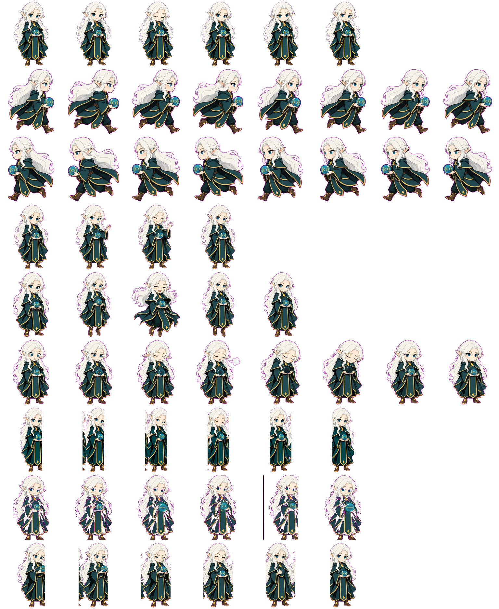

# 🔮 Avari — Codex Pet v2

[](https://buymeacoffee.com/OstKost)
[](https://boosty.to/ostkost/purchase/4098348?ssource=DIRECT&share=subscription_link)
[](LICENSE)


A white-haired elf, **Avari**, wearing a midnight teal-navy cloak with muted old-gold trim. She creates code as magic inside a glass sphere held in her hands.

Avari is compatible with the **Codex Pet v2** standard (`spriteVersionNumber: 2`) for **ChatGPT Desktop / Codex Desktop**. It includes 9 base animations (rows 0–8), 16 look directions (rows 9–10), and a neutral cell.

## ⚡ Quick Install

Choose any installation method:

### 1. NPX (recommended / universal)

If Node.js is installed (macOS, Linux, or Windows):

```bash
npx avari-pet
# or directly from the repository:
npx github:OstKost/avari-pet
```

### 2. Terminal (macOS & Linux one-liner)

No additional dependencies required:

```bash
curl -fsSL https://raw.githubusercontent.com/OstKost/avari-pet/main/install.sh | bash
```

### 3. PowerShell (Windows one-liner)

Run in PowerShell:

```powershell
irm https://raw.githubusercontent.com/OstKost/avari-pet/main/install.ps1 | iex
```

### 4. Manual installation (GitHub Releases ZIP)

1. Download `avari-v2.1.0.zip` from the [Releases](https://github.com/OstKost/avari-pet/releases) page.
2. Extract the `avari/` folder to the Codex pets directory:
   - **macOS / Linux:** `~/.codex/pets/avari/`
   - **Windows:** `%USERPROFILE%\.codex\pets\avari\`
3. Restart ChatGPT / Codex Desktop and select **Avari** in the pet selector.

## 📁 Package Structure

```text
~/.codex/pets/avari/
├── pet.json           # Pet v2 manifest
└── spritesheet.webp   # Optimized 8x11 atlas (1536x2288 px, ~2.4 MB)
```

## 🛠 Development and Build

For developers and contributors:

```bash
# Build a clean release distribution in dist/
npm run build

# Create avari-v2.1.0.zip for GitHub Releases
npm run package

# Install locally for testing
npm run install-local
```

## 🎨 Design and Animations

- **idle (row 0):** breathing, blinking, and subtle hair movement.
- **running-right (row 1):** steps to the right with cloak movement.
- **running-left (row 2):** steps to the left with cloak movement.
- **waving (row 3):** waves hello.
- **jumping (row 4):** a short, joyful jump.
- **failed (row 5):** the spell contracts in her hands; puzzled expression.
- **waiting (row 6):** questioning look toward the user and an open palm.
- **running (row 7):** focused weaving of code symbols into a spell inside the sphere.
- **review (row 8):** carefully examines the created code seal.
- **look-row-9 & 10 (rows 9–10):** 16 continuous look directions clockwise from 0° to 337.5°.

## ❤️ Support the Project

**Avari** is a free, open project. If the pet makes your coding sessions more enjoyable, you can support its creator with a coffee or subscription:

- 🇷🇺 **For users in Russia / CIS (Russian cards / SBP):**
  - [Boosty.to/ostkost](https://boosty.to/ostkost/purchase/4098348?ssource=DIRECT&share=subscription_link) — one-time donations and subscriptions.
- 🌎 **For international supporters (cards / Stripe / PayPal):**
  - [Buy Me a Coffee](https://buymeacoffee.com/OstKost) — quick tip with card or Apple Pay.
  - [Ko-fi](https://ko-fi.com/ostkost) — 0% fee tips.

---

## 🇷🇺 Русская версия

Белая эльфийка **Avari Keys** в полночном сине-зелёном плаще со старинной золотой каймой, созидающая код как магию внутри стеклянной сферы в руках.

Совместима со стандартом **Codex Pet v2** (`spriteVersionNumber: 2`) для **ChatGPT Desktop / Codex Desktop**. Включает 9 базовых анимаций (строки 0–8), 16 направлений взгляда (строки 9–10) и нейтральную ячейку.

### ⚡ Быстрая установка

Выберите любой удобный способ установки:

1. **NPX:** `npx avari-pet` или `npx github:OstKost/avari-pet`
2. **macOS / Linux:** `curl -fsSL https://raw.githubusercontent.com/OstKost/avari-pet/main/install.sh | bash`
3. **Windows PowerShell:** `irm https://raw.githubusercontent.com/OstKost/avari-pet/main/install.ps1 | iex`
4. **Вручную:** скачайте `avari-v2.1.0.zip` со страницы [Releases](https://github.com/OstKost/avari-pet/releases), распакуйте `avari/` в `~/.codex/pets/avari/` или `%USERPROFILE%\.codex\pets\avari\`, затем перезапустите ChatGPT / Codex Desktop.

### 📁 Структура пакета

```text
~/.codex/pets/avari/
├── pet.json           # Манифест питомца v2
└── spritesheet.webp   # Оптимизированный атлас 8x11 (1536x2288 px, ~2.4 MB)
```

### 🛠 Разработка и сборка

```bash
npm run build         # сборка чистого релизного дистрибутива в dist/
npm run package       # создание avari-v2.1.0.zip для GitHub Releases
npm run install-local # локальная установка для проверки
```

### 🎨 Дизайн и анимации

- **idle (ряд 0):** дыхание, моргание, лёгкое движение волос.
- **running-right / running-left (ряды 1–2):** шаги с движением плаща.
- **waving (ряд 3):** приветствие рукой.
- **jumping (ряд 4):** короткий радостный прыжок.
- **failed (ряд 5):** заклинание сжимается в ладонях; озадаченный взгляд.
- **waiting (ряд 6):** вопросительный взгляд на пользователя и открытая ладонь.
- **running (ряд 7):** сосредоточенно сплетает символы кода в заклинание внутри сферы.
- **review (ряд 8):** внимательно рассматривает созданную печать кода.
- **look-row-9 & 10 (ряды 9–10):** 16 непрерывных направлений взгляда по часовой стрелке от 0° до 337.5°.

### ❤️ Поддержать проект

**Авари** — полностью бесплатный открытый проект. Поддержать автора можно через [Boosty.to/ostkost](https://boosty.to/ostkost/purchase/4098348?ssource=DIRECT&share=subscription_link), [Buy Me a Coffee](https://buymeacoffee.com/OstKost) или [Ko-fi](https://ko-fi.com/ostkost).

---

## 🧩 Full Spritesheet


