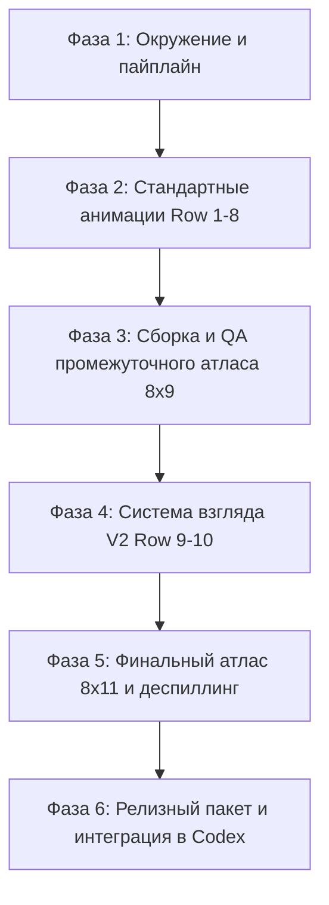

# План полной разработки питомца Авари для Codex (v2)

> **Статус документа**: Утверждён к реализации  
> **Версия спецификации**: Codex Hatch-Pet v2 (`spriteVersionNumber: 2`)  
> **Формат атласа**: 8 колонок × 11 строк (1536×2288 px), размер ячейки 192×208 px  
> **Целевой персонаж**: Авари — эльфийка Avari Keys, код как магия в парящей сфере

---

## 1. Текущий статус проработки (Аудит на текущий момент)

### 1.1. Что уже выполнено и утверждено
1. **Визуальная концепция и дизайн-код**:
   - Концепт согласован на базе `_docs/Avari Keys — Design System.md`.
   - Внешность утверждена пользователем: длинные белые волосы (#F2F0E8 / тени #A8B4B7), заострённые уши, глубокие сапфирово-синие глаза (#123B80), полуночный сине-зелёный плащ (#06141B, #0A1D26, #102833) со сдержанной отделкой состаренным золотом (#D9B96E).
   - Магический артефакт зафиксирован: вместо ранней плоской печати/кольца утверждён **цельный стеклянный голубовато-синий шар/сфера в ладонях**, внутри которого светятся золотые символы кода `{<>}`.
2. **Базовый спрайт (Production Base)**:
   - Создан и очищен финальный файл основы: [`production-base-orb-final.png`](file:///Volumes/KingstonM2/Projects/avari-pet/production-base-orb-final.png).
   - Проведена проверка ассет-фита ([`asset-fit-review-orb-final/asset_fit.json`](file:///Volumes/KingstonM2/Projects/avari-pet/asset-fit-review-orb-final/asset_fit.json)) с результатом **PASS** (чистый альфа-канал, отсутствие паразитного фона, корректный bbox `[54, 25, 137, 183]` внутри ячейки 192×208 px, палитра 96 цветов).
   - Уменьшенная ячейка [`cell-preview.png`](file:///Volumes/KingstonM2/Projects/avari-pet/asset-fit-review-orb-final/cell-preview.png) подтверждена.
3. **Развёртывание пайплайна и инфраструктуры run**:
   - Папка запуска [`run/`](file:///Volumes/KingstonM2/Projects/avari-pet/run/) инициализирована под официальный стандарт `hatch-pet v2`.
   - Сгенерированы геометрические гайды раскладки для всех полос анимаций в `run/references/layout-guides/*.png` (с безопасными полями 18px по X и 16px по Y).
   - Сформированы спецификации и промпты для всех строк (`run/prompts/rows/*.md`).
   - Сконфигурирован манифест задач [`run/imagegen-jobs.json`](file:///Volumes/KingstonM2/Projects/avari-pet/run/imagegen-jobs.json) и параметры хромакея (`#FF00FF`, стиль `painterly`).
4. **Готовые анимационные блоки**:
   - `base`: **Завершено** ([`run/decoded/base.png`](file:///Volumes/KingstonM2/Projects/avari-pet/run/decoded/base.png), сохранён как канонический референс [`run/references/canonical-base.png`](file:///Volumes/KingstonM2/Projects/avari-pet/run/references/canonical-base.png)).
   - `idle` (покой, строка 0): **Завершено** ([`run/decoded/idle.png`](file:///Volumes/KingstonM2/Projects/avari-pet/run/decoded/idle.png), 6 кадров извлечены в `run/qa/rows/idle/frames/`, формальная проверка [`review.json`](file:///Volumes/KingstonM2/Projects/avari-pet/run/qa/rows/idle/review.json) пройдена с `ok: true`).

### 1.2. Что остаётся сделать (Разрыв до релиза)
- **7 стандартных анимаций (строки 1–8)**: `running-right`, `running-left`, `waving`, `jumping`, `failed`, `waiting`, `running`, `review` находятся в статусе `pending`.
- **Сборка промежуточного атласа 8×9**: пока не собран промежуточный лист и превью-гифки стандартных движений.
- **Спецификация механики взгляда (`qa/look-mechanics.md`)**: нужно явно зафиксировать поведение глаз, головы, ушей и удерживаемой сферы для гуманоидного персонажа.
- **Кардинальные якоря взгляда (`look-cardinals`)**: не сгенерированы 4 опорных направления (000°, 090°, 180°, 270°).
- **Синтез рядов взгляда (строки 9 и 10)**: не сгенерированы 16 направлений (по 8 на строку).
- **Деспиллинг и финальная сборка v2**: не собран атлас 8×11 (1536×2288), не выполнен деспилл мадженты `#FF00FF`.
- **QA-пакет валидации**: слепой тест осей (Blind Direction QA), проверка неразрывности траектории (continuity review), проверка отсутствия артефактов.
- **Инсталляционный пакет**: формирование `~/.codex/pets/avari/pet.json` и `spritesheet.webp`.

---

## 2. Архитектура и требования к ассету v2

### 2.1. Структура атласа (8 колонок × 11 строк)

| Строка | Состояние | Кадров | Назначение / Описание |
|---|---|:---:|---|
| **Row 0** | `idle` | 6 | **ГОТОВО.** Спокойное дыхание, моргание, мягкое движение волос. Сфера неподвижна в руках. |
| **Row 1** | `running-right` | 8 | Бег вправо: перенос веса, динамика подола плаща и волос, сфера следует за корпусом. |
| **Row 2** | `running-left` | 8 | Бег влево: зеркальное или раздельно сгенерированное движение с сохранением читаемости. |
| **Row 3** | `waving` | 4 | Приветствие: мягкий взмах одной рукой, вторая удерживает сферу у пояса. |
| **Row 4** | `jumping` | 5 | Радостный вертикальный прыжок: присед, отталкивание, пик, приземление (без пыли и теней). |
| **Row 5** | `failed` | 8 | Ошибка / отмена: магия в сфере угасает/сжимается, озадаченный взгляд, затем готовность повторить. |
| **Row 6** | `waiting` | 6 | Ожидание ввода пользователя: вопросительный наклон головы, открытая ладонь. |
| **Row 7** | `running` | 6 | **Работа над кодом**: пальцы перебирают символы `{<>}` внутри сферы, грани светятся (НЕ бег!). |
| **Row 8** | `review` | 6 | Проверка результата: Авари наклоняется к сфере, изучает готовый код и одобрительно кивает. |
| **Row 9** | `look-row-9` | 8 | Взгляд по часовой стрелке: `000°` (вверх), `022.5°`, `045°`, `067.5°`, `090°` (вправо), `112.5°`, `135°`, `157.5°`. |
| **Row 10** | `look-row-10` | 8 | Взгляд по часовой стрелке: `180°` (вниз), `202.5°`, `225°`, `247.5°`, `270°` (влево), `292.5°`, `315°`, `337.5°`. |

### 2.2. Железные визуальные ограничения (Sprite-Safe Constraints)
1. **Фон**: строго однородный хромакей `#FF00FF` во всех генерируемых полосах. Никаких шахматных текстур (checkerboard), теней на полу, свечений, плавающих искорок или градиентов.
2. **Артефакт**: сфера **всегда** контактирует с руками (никаких отдельно висящих в воздухе объектов).
3. **Целостность силуэта**: внутри персонажа не должно быть 100% прозрачных дыр или разрывов.
4. **Габариты ячейки**: каждый кадр должен гарантированно укладываться в `192×208` px с полями отступа не менее 18 px по горизонтали и 16 px по вертикали.

---

## 3. Детальный пошаговый план разработки



### Фаза 1. Подготовка окружения и утилит
- [x] **1.1. Настройка Python-окружения для запуска скриптов hatch-pet**:
  - Убедиться в наличии модуля `Pillow` в интерпретаторе Python (через `/opt/homebrew/bin/python3` или специализированный venv).
  - Проверить работоспособность скриптов из `/Applications/ChatGPT.app/Contents/Resources/skills/skills/.curated/hatch-pet/scripts/` (`extract_strip_frames.py`, `inspect_frames.py`, `compose_atlas.py`, `despill_chroma_edges.py`, `validate_atlas.py`).
- [x] **1.2. Проверка привязки канонических референсов**:
  - Проверить наличие и целостность [`run/references/canonical-base.png`](file:///Volumes/KingstonM2/Projects/avari-pet/run/references/canonical-base.png) и гайдов `run/references/layout-guides/*.png`.

---

### Фаза 2. Производство стандартных анимаций (Строки 1–8)

Для каждой задачи выполняется регламент: генерация полосы кадров на фоне `#FF00FF` с прикреплением `canonical-base.png` и соответствующего `layout-guide.png` $\rightarrow$ сохранение в `run/decoded/<state>.png` $\rightarrow$ нарезка кадров $\rightarrow$ покадровая верификация `inspect_frames.py`.

- [x] **2.1. Строка 1: `running-right` (8 кадров)**:
  - Генерация бега вправо. Контроль: направление движения вправо, покачивание волос и плаща, сфера в руках, отсутствие пыли под ногами.
  - Нарезка кадров в `run/qa/rows/running-right/frames/`, проверка bbox и отступов.
- [x] **2.2. Строка 2: `running-left` (8 кадров)**:
  - Инспекция `running-right`: если асимметрия одежды/причёски позволяет, применить детерминированное покадровое зеркалирование:
    ```bash
    python3 /Applications/ChatGPT.app/.../derive_running_left_from_running_right.py \
      --run-dir output/avari-pet/run --confirm-appropriate-mirror \
      --decision-note "симметричный костюм и прическа Авари сохраняют идентичность при покадровом отражении"
    ```
  - Если зеркалирование искажает детали — отдельная генерация через $imagegen.
  - Верификация кадров `running-left`.
- [x] **2.3. Строка 3: `waving` (4 кадра)**:
  - Генерация приветствия: правая рука делает мягкий жест приветствия, левая рука держит сферу у пояса. Никаких нарисованных линий взмаха или символов вокруг руки.
  - Нарезка и инспекция кадров.
- [x] **2.4. Строка 4: `jumping` (5 кадров)**:
  - Генерация вертикального прыжка: присед, взлёт, зависание, приземление, возврат. Контроль: верхняя граница головы в прыжке не должна выходить за пределы безопасных полей (отступ 16 px сверху).
  - Нарезка и инспекция кадров.
- [x] **2.5. Строка 5: `failed` (8 кадров)**:
  - Генерация реакции на ошибку: Авари растерянно смотрит на сферу, символы внутри затухают или сжимаются, затем собирается с духом. Никаких красных крестов `X` или оторванных от спрайта слёз/дыма.
  - Нарезка и инспекция кадров.
- [x] **2.6. Строка 6: `waiting` (6 кадров)**:
  - Генерация ожидания: спокойная поза, вопросительный наклон головы, свободная ладонь приоткрывается навстречу пользователю.
  - Нарезка и инспекция кадров.
- [x] **2.7. Строка 7: `running` (выполнение задачи / кодинг, 6 кадров)**:
  - **Критический нюанс**: это НЕ бег ногами! Авари сосредоточенно плетёт заклинание: пальцы двигают золотые скобки `{<>}` внутри сферы, по сфере пробегают голубые грани.
  - Нарезка и инспекция кадров.
- [x] **2.8. Строка 8: `review` (проверка результата, 6 кадров)**:
  - Генерация инспекции: Авари наклоняется над созданной сферой, внимательно считывает получившийся код слева направо и делает сдержанный утверждающий кивок.
  - Нарезка и инспекция кадров.

---

### Фаза 3. Сборка и верификация промежуточного атласа (8×9)

- [x] **3.1. Извлечение полного набора стандартных кадров**:
  ```bash
  python3 scripts/extract_strip_frames.py \
    --decoded-dir run/decoded --output-dir run/frames --states all --method auto
  ```
- [x] **3.2. Компоновка промежуточного атласа 8×9**:
  ```bash
  python3 scripts/compose_atlas.py \
    --frames-root run/frames \
    --output run/final/spritesheet.png \
    --webp-output run/final/spritesheet.webp
  ```
- [x] **3.3. Создание обзорных материалов**:
  - Контактный лист всех стандартных анимаций: `run/qa/contact-sheet.png`.
  - Рендеринг анимационных GIF-превью по всем 9 действиям: `run/qa/previews/*.gif`.
- [x] **3.4. Визуальный аудит стандартных рядов**:
  - Проверка на отсутствие скачков масштаба (size popping) и дрожания базовой линии (baseline drift).
  - При наличии артефактов привязки — повторный запуск экстракции с опцией `--method stable-slots`.
  - Фиксация статуса готовности строк 0–8.

---

### Фаза 4. Разработка системы взгляда V2 (Строки 9–10)

- [x] **4.1. Формализация документа механики взгляда (`qa/look-mechanics.md`)**:
  - Зафиксировать анатомические правила:
    - *Опора (База)*: стопы, подол плаща и корпус зафиксированы на месте (никакого вращения спрайта целиком!).
    - *Взгляд и голова*: глаза ведут направление взгляда, голова и шея поворачиваются мягко, острые ушки и пряди белых волос слегка отклоняются с естественным инерционным запаздыванием.
    - *Сфера*: остаётся в руках, при повороте головы слегка смещается ракурс восприятия или перекрытие руками, но сфера не отрывается от тела.
- [x] **4.2. Калибровка кардинальных направлений (`look-cardinals`)**:
  - Генерация полосы 4 главных направлений: `000` (вверх), `090` (вправо), `180` (вниз), `270` (влево).
  - Извлечение отдельных ячеек через `extract_cardinal_anchors.py`.
  - Утверждение полярности (особенно `090` строго вправо по экрану, `270` строго влево по экрану).
  - Сборка эталонной полосы `run/decoded/look-anchors-approved.png`.
- [x] **4.3. Синтез строки 9 (`look-row-9`, 8 направлений: 000° – 157.5°)**:
  - Генерация полосы из 8 положений на основе утверждённых кардиналов с интерполяцией шагом 22.5°.
  - Регистрация и проверка совмещения через `assemble_extended_atlas.py` (с флагом `--registered-row-output`).
  - Проверка отсутствия артефактов на границах ячеек.
- [x] **4.4. Синтез строки 10 (`look-row-10`, 8 направлений: 180° – 337.5°)**:
  - Генерация полосы из 8 положений с передачей готового `look-row-9` в качестве референса неразрывности (стык `157.5° -> 180°` и замыкание `337.5° -> 000°`).
  - Регистрация и покадровая проверка.

---

### Фаза 5. Финальная сборка атласа 8×11, деспиллинг и верификация

- [x] **5.1. Сборка полного атласа (1536×2288 px)**:
  ```bash
  python3 scripts/assemble_extended_atlas.py \
    --base-atlas run/final/spritesheet.webp \
    --registered-row-9 run/qa/look-row-9-registered.png \
    --row-9-registration run/qa/look-row-9-registration.json \
    --look-row-10 run/decoded/look-row-10.png \
    --neutral-cell run/frames/idle/00.png \
    --chroma-key "#FF00FF" \
    --chroma-threshold 96 \
    --output run/final/spritesheet-extended.png \
    --webp-output run/final/spritesheet-extended.webp \
    --manifest-output run/final/spritesheet-extended.json
  ```
- [x] **5.2. Деспиллинг краёв хромакея (Edge-local Chroma Despill)**:
  ```bash
  python3 scripts/despill_chroma_edges.py \
    run/final/spritesheet-extended.png \
    --output run/final/spritesheet-extended.png \
    --webp-output run/final/spritesheet-extended.webp \
    --chroma-key "#FF00FF" \
    --json-out run/qa/chroma-despill-extended.json
  ```
- [x] **5.3. Автоматическая валидация атласа**:
  ```bash
  python3 scripts/validate_atlas.py \
    run/final/spritesheet-extended.webp \
    --json-out run/final/validation-extended.json \
    --chroma-key "#FF00FF" \
    --require-v2
  ```
- [x] **5.4. Генерация QA-материалов**:
  - Расширенный контактный лист: `run/qa/contact-sheet-extended.png`.
  - Карточка всех 16 направлений взгляда с метками градусов: `run/qa/look-directions.png`.
  - Замер непрерывности траектории взгляда: `run/qa/look-continuity.json`.
- [x] **5.5. Слепой тест направлений (Blind Direction QA)**:
  - Формирование анонимизированной карты пар `run/qa/direction-blind-pairs.png` без указания градусов.
  - Проведение классификации осей (up/down/left/right) тремя независимыми проходами.
  - Агрегация вердиктов и проверка кардиналов (`000 vs 180` и `090 vs 270` обязаны сойтись на 100%).
- [x] **5.6. Формирование итогового отчёта запуска**:
  - Запись `run/qa/run-summary.json`.

---

### Фаза 6. Упаковка, интеграция в Codex и приёмочное тестирование

- [x] **6.1. Формирование установочного пакета питомца**:
  - Создание директории питомца в профиле Codex:
    ```bash
    mkdir -p ~/.codex/pets/avari
    ```
  - Копирование финализированного атласа:
    ```bash
    cp run/final/spritesheet-extended.webp ~/.codex/pets/avari/spritesheet.webp
    ```
  - Создание дескриптора [`pet.json`](file:///Users/ostkost/.codex/pets/avari/pet.json):
    ```json
    {
      "id": "avari",
      "displayName": "Авари",
      "description": "Белая эльфийка Avari Keys в тёмном сине-зелёном плаще, созидающая код как магию внутри парящей сферы.",
      "spriteVersionNumber": 2,
      "spritesheetPath": "spritesheet.webp"
    }
    ```
- [x] **6.2. Интеграционное тестирование в Codex Desktop**:
  - Перезапуск или горячая перезагрузка ассистента в приложении Codex / ChatGPT App.
  - Выбор питомца «Авари» в настройках.
  - Проверка отображения в реальном масштабе на рабочем столе:
    - Читаемость лица, сапфировых глаз и золотых символов `{<>}` в сфере.
    - Плавность анимации покоя (`idle`).
    - Плавность трекинга взгляда за курсором мыши по всем 16 румбам.
    - Корректность запуска анимации работы (`running` — плетение заклинания) во время генерации ответа моделью.
    - Корректность реакции на успешное завершение задачи (`review` / `jumping`) и на отмену/ошибку (`failed`).
- [x] **6.3. Финализация репозитория**:
  - Обновление [`README.md`](file:///Volumes/KingstonM2/Projects/avari-pet/README.md) и [`progress.md`](file:///Volumes/KingstonM2/Projects/avari-pet/progress.md).
  - Архивирование/очистка промежуточных отладочных файлов (сохранение только релизных артефактов и QA-отчётов).

---

## 4. Матрица рисков и стратегия их снижения

| Риск | Вероятность | Влияние | Стратегия предотвращения / решения |
|---|:---:|:---:|---|
| **Дрейф стиля/внешности** между строками (другой цвет плаща, форма ушей, лицо) | Средняя | Высокое | Все промпты строк жёстко связываются с `canonical-base.png` и фиксируют палитру `#06141B`, `#D9B96E`, `#123B80`. |
| **Паразитный фон или неполная прозрачность** вокруг мелких деталей (пальцы, пряди) | Высокая | Высокое | Использование чистого `#FF00FF` хромакея без сжатия в JPEG + процедурный деспиллер `despill_chroma_edges.py`. |
| **Ошибочная анимация `running`** (генератор рисует обычный бег ногами вместо кодинга) | Высокая | Критическое | В промпте `prompts/rows/running.md` введён явный запрет на шаги, бег ногами и дорожки. Только ручная магия со сферой. |
| **Дрожание базовой линии (Jumping baseline)** при смене кадров | Средняя | Среднее | Использование метода экстракции `--method stable-slots` и привязка стоп к нижней направляющей ячейки. |
| **Рассинхрон или неестественность взгляда** в строках 9–10 | Высокая | Высокое | Генерация строк 9 и 10 как единых связных 8-кадровых семейств от 4 утверждённых кардиналов, а не по отдельным ячейкам. |
| **Отказ загрузки в Codex Desktop** из-за несоответствия формата | Низкая | Блокирующее | Строгое соблюдение спецификации v2: 11 строк, 2288 px высота, флаг `spriteVersionNumber: 2` в манифесте. |

---

## 5. Оценка трудозатрат и контрольные точки (Milestones)

- **M1 (Окружение и строки 1–4)**: Настроен Python/Pillow, сгенерированы и проверены `running-right`, `running-left`, `waving`, `jumping`.
- **M2 (Строки 5–8 и промежуточный атлас 8×9)**: Готовы `failed`, `waiting`, `running`, `review`. Собран промежуточный атлас, проверены GIF-превью.
- **M3 (Система взгляда v2)**: Зафиксирована механика взгляда, утверждены 4 кардинала, сгенерированы и зарегистрированы строки 9 и 10.
- **M4 (Финальный релиз v2)**: Собран атлас 8×11, выполнен деспиллинг, пройдены валидаторы и слепой тест, питомец установлен в `~/.codex/pets/avari/` и протестирован в живой среде.
